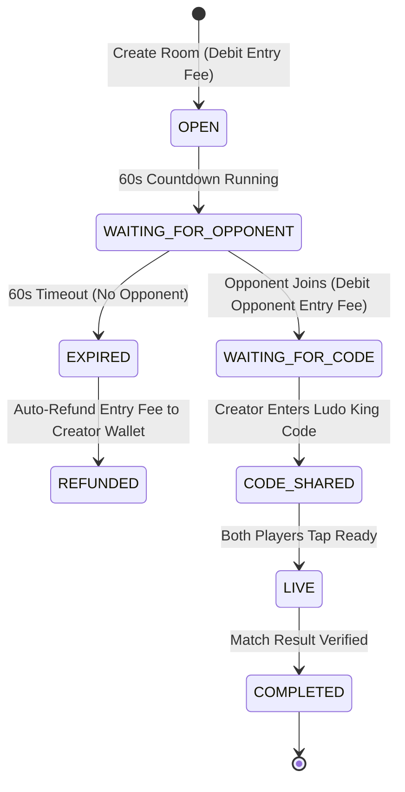

# Royal Ludo — Backend Specifications & Architectural Requirements

> **Document Status**: Production Backend Implementation Blueprint  
> **Version**: 1.0.0  
> **Target Systems**: Node.js / Express or Python FastAPI Server, MongoDB / PostgreSQL Database, Redis Cache  

---

## 1. Database Architecture & Schema Specifications

### 1.1 Collections / Tables Schema Definitions

#### 1. User Entity (`users`)
- `_id` / `id`: String (UUID or ObjectId)
- `mobile`: String (Indexed, Unique, 10-digit Indian phone format)
- `password_hash`: String (Bcrypt / Argon2 encrypted)
- `username`: String (Unique, min 3, max 20 chars)
- `avatar_id`: String (`av1` .. `av8` or `custom`)
- `avatar_url`: String (Path or URL)
- `referral_code`: String (Unique 6-8 char code, indexed)
- `referred_by`: String (Referrer user ID or code, nullable)
- `total_balance`: Number (Derived: `deposit_balance + winning_balance + bonus_balance`)
- `deposit_balance`: Number (Non-negative decimal, default 0.0)
- `winning_balance`: Number (Non-negative decimal, default 0.0)
- `bonus_balance`: Number (Non-negative decimal, default 0.0)
- `kyc_status`: String Enum (`NOT_SUBMITTED`, `PENDING`, `VERIFIED`, `REJECTED`)
- `is_wallet_frozen`: Boolean (Default false)
- `status`: String Enum (`ACTIVE`, `SUSPENDED`, `BANNED`)
- `total_wins`: Integer (Default 0)
- `total_matches`: Integer (Default 0)
- `created_at`: Timestamp
- `updated_at`: Timestamp

#### 2. Challenge Room Entity (`rooms`)
- `id`: String (Room ID, e.g. `rm_99201`)
- `room_code`: String (Short display code e.g. `RL-9920`, unique, indexed)
- `creator_id`: String (User ID, FK to `users`)
- `opponent_id`: String (User ID, FK to `users`, nullable)
- `entry_fee`: Number (Minimum 10.0)
- `prize_pool`: Number (`entry_fee * 2 * 0.95`, i.e., 5% platform fee)
- `status`: String Enum (`OPEN`, `WAITING_FOR_OPPONENT`, `MATCHED`, `WAITING_FOR_CODE`, `CODE_SHARED`, `READY_TO_PLAY`, `LIVE`, `COMPLETED`, `EXPIRED`, `REFUNDED`)
- `ludo_king_code`: String (6-digit alphanumeric Ludo King code, nullable)
- `winner_id`: String (User ID, nullable)
- `loser_id`: String (User ID, nullable)
- `created_at`: Timestamp
- `expires_at`: Timestamp (Creation time + 60s waiting window)

#### 3. Match Result Entity (`match_results`)
- `id`: String
- `room_id`: String (FK to `rooms`)
- `user_id`: String (FK to `users`)
- `submitted_status`: String Enum (`WON`, `LOST`, `CANCELLED`)
- `screenshot_url`: String (Nullable)
- `review_status`: String Enum (`PENDING`, `APPROVED`, `REJECTED`)
- `submitted_at`: Timestamp

#### 4. Wallet Transactions Entity (`wallet_transactions`)
- `id`: String (Unique Transaction ID, e.g. `txn_881023`)
- `user_id`: String (FK to `users`, indexed)
- `title`: String (Human readable description)
- `amount`: Number
- `type`: String Enum (`DEPOSIT`, `WITHDRAWAL`, `MATCH_JOINED`, `MATCH_WON`, `REFUND`, `TASK_BONUS`, `SCRATCH_BONUS`, `REFERRAL_BONUS`)
- `is_credit`: Boolean (true for addition, false for deduction)
- `balance_after`: Number
- `created_at`: Timestamp

#### 5. Deposits Entity (`deposits`)
- `id`: String
- `user_id`: String (FK to `users`)
- `amount`: Number (Min 50.0)
- `payment_method`: String Enum (`UPI`, `QR`)
- `utr_number`: String (Unique 12-digit reference)
- `screenshot_url`: String
- `status`: String Enum (`PENDING_VERIFICATION`, `APPROVED`, `REJECTED`)
- `admin_notes`: String (Nullable)
- `created_at`: Timestamp

#### 6. Withdrawals Entity (`withdrawals`)
- `id`: String
- `user_id`: String (FK to `users`)
- `amount`: Number (Min 100.0)
- `method_type`: String Enum (`UPI`, `BANK_ACCOUNT`)
- `upi_id`: String (Nullable)
- `account_number`: String (Nullable)
- `ifsc_code`: String (Nullable)
- `status`: String Enum (`PENDING_APPROVAL`, `APPROVED`, `REJECTED`)
- `created_at`: Timestamp

#### 7. Admin Chat Messages Entity (`chat_messages`)
- `id`: String
- `user_id`: String (FK to `users`, indexed)
- `sender_role`: String Enum (`PLAYER`, `ADMIN`)
- `text`: String (Max 500 characters, text only)
- `is_read`: Boolean (Default false)
- `timestamp`: Timestamp

---

## 2. Room State Machine & Expiry Engine

---

## 3. Financial Engine & Wallet Transaction Rules

1. **Balance Hierarchy**:
   - `total_balance` = `deposit_balance + winning_balance + bonus_balance`
2. **Entry Fee Deduction Order**:
   - When joining/creating a room of entry fee $E$:
     1. Deduct first from `bonus_balance` (up to max 10% allowed by platform rules).
     2. Deduct remainder from `deposit_balance`.
     3. Deduct remainder from `winning_balance`.
3. **Room Refund Rule**:
   - When a room expires or is cancelled, refund the exact amount deducted back into the respective balance categories (`deposit_balance`, `bonus_balance`, etc.).
4. **Winnings Credit Rule**:
   - Winnings ($PrizePool = EntryFee * 2 * 0.95$) MUST ALWAYS be credited exclusively to `winning_balance`.
5. **Withdrawal Check**:
   - Withdrawals can ONLY be drawn from `winning_balance`. `deposit_balance` and `bonus_balance` cannot be withdrawn directly without gameplay.

---

## 4. Administrative Support Chat Specifications

1. **Text-Only Policy**: Strict backend validation rejecting non-text payloads (reject attachments/MIME uploads in chat API).
2. **Unread Counter**: `GET /chat/unread-count` returns count of messages where `sender_role == 'ADMIN'` and `is_read == false`.
3. **Read Status Update**: Calling `GET /chat/messages` or `PUT /chat/read` sets `is_read = true` for all admin messages sent to the calling user.

---

## 5. File System & Upload Requirements

1. **Local Server Directory**: Storage root `/public/uploads/` with subfolders:
   - `/public/uploads/avatars/`
   - `/public/uploads/proofs/`
   - `/public/uploads/payment_screenshots/`
2. **File Rules**: Max file size 200 KB, supported extensions: `.png`, `.jpg`, `.jpeg`, `.webp`.
3. **Static File Serving**: Express/FastAPI static middleware configured to serve `/uploads/...`.

---

## 6. Background Workers & Cron Requirements

1. **Room Waiting Expiry Worker (Every 10 Seconds)**:
   - Find rooms with `status == 'WAITING_FOR_OPPONENT'` and `expires_at < NOW()`.
   - Update room status to `EXPIRED`.
   - Refund entry fee to `creator_id`'s wallet.
   - Insert `REFUND` transaction log.
2. **Daily Tasks Reset Cron (Every midnight 00:00 UTC)**:
   - Reset user daily task progress counters.
3. **Daily Scratch Cards Allocation Cron (Every midnight 00:00 UTC)**:
   - Allocate 1 daily scratch card to all active users.

---

## 7. Security, Concurrency & Anti-Fraud Engine

1. **Idempotency & Race Condition Lock**:
   - Use MongoDB transactions or PostgreSQL `SELECT ... FOR UPDATE` on user wallet balances during room creation/joining to prevent negative balance race conditions.
2. **Single Active Room Lock**:
   - Ensure a user cannot create or join a second room if an active room exists for that user ID.
3. **UTR Uniqueness Lock**:
   - Unique index on `deposits.utr_number` to prevent double-submitting payment proofs.

---

## 8. Admin Panel Architecture & Management Requirements

The Web Admin Panel MUST be designed strictly from the backend APIs and entity schemas:

1. **User Management Dashboard**:
   - Search/View users by phone number or username.
   - Toggle wallet freeze status (`is_wallet_frozen`).
   - Modify user status (`ACTIVE`, `SUSPENDED`, `BANNED`).
2. **Deposit Verification Panel**:
   - View pending deposit requests (`status == 'PENDING_VERIFICATION'`).
   - Inspect user-submitted UTR number and payment receipt screenshot.
   - Actions: `APPROVE` (credit `deposit_balance`) or `REJECT` (with rejection reason).
3. **Withdrawal Approval Panel**:
   - View pending withdrawal requests (`status == 'PENDING_APPROVAL'`).
   - Inspect user UPI ID / Bank details.
   - Actions: `APPROVE` or `REJECT` (refund `winning_balance`).
4. **Match Dispute & Proof Review Panel**:
   - View flagged match disputes and submitted screenshots.
   - Override match outcome to declare Winner / Loser / Refund.
5. **Support Chat Operations Console**:
   - Real-time text messaging interface with players.
   - View unread ticket count and player chat histories.

---
*End of Backend Requirements Document.*
